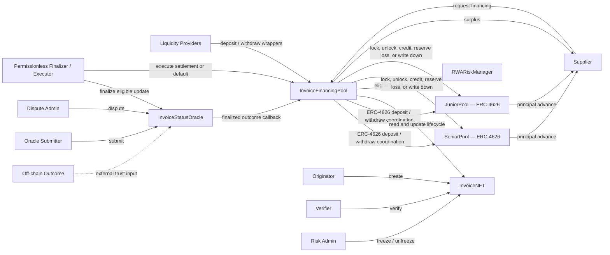

# RWA Invoice Financing Protocol

## 1. Overview

This repository implements a Solidity reference protocol for financing verified invoices through separate Senior and Junior `ERC-4626` liquidity tranches. Each invoice is represented by a non-transferable `ERC-721` claim with an explicit lifecycle. Only the recorded Supplier may request financing, and each request is subject to invoice eligibility, Buyer denylist checks, active-principal concentration limits, and available tranche liquidity. Off-chain settlement or default outcomes enter through a permissioned, disputable oracle with bounded finalization timing. Finalization records the protocol's attestation without economically resolving the position; a finalized `DEFAULTED` outcome nevertheless reserves its canonical tranche impairment in NAV immediately. Permissionless execution later supplies the required assets and completes settlement or default accounting.

> **Status:** This is a locally verified portfolio/reference implementation. An independent external security review has been completed and its findings dispositioned, but this is not a formal production audit or formal verification. The protocol is not publicly deployed and is not represented as production-ready.

## 2. Design Highlights

- **Explicit invoice lifecycle:** `CREATED`, `VERIFIED`, `FUNDED`, `SETTLED`, and `DEFAULTED` states constrain lifecycle transitions, with `FROZEN` serving as an operational and legal-risk overlay for eligible invoices.

- **Non-transferable invoice claims:** `InvoiceNFT` records ownership and invoice terms without allowing claims to trade as ordinary transferable NFTs.

- **Supplier-only financing:** an authorized Originator creates the invoice for a Supplier, but only that recorded Supplier may later request financing.

- **Two liquidity tranches:** independent Senior and Junior `ERC-4626` pools fund each invoice according to constructor-configured allocation shares.

- **Underwriting controls:** `RWARiskManager` applies minimum invoice size, maximum remaining tenor, Buyer denylisting, eligibility checks, advance-rate rules, and active-principal concentration limits.

- **Separated attestation and execution:** `InvoiceStatusOracle` finalizes an outcome, while `InvoiceFinancingPool` reserves finalized default impairment and later performs asset movements and accounting resolution.

- **Deterministic economic waterfalls:** paid settlement distributes principal and stored financing fees; default recovery is allocated Senior-first, producing a Junior-first loss waterfall.

- **Layered verification:** unit, integration, fuzz, and stateful invariant tests include a handler-maintained ghost model that reconstructs expected accounting independently of financing-position storage.

## 3. Architecture

The protocol separates invoice identity, underwriting, liquidity, oracle attestation, and economic execution into narrowly scoped contracts and roles.



### Core Contracts

| Contract | Responsibility | Primary boundary |
|---|---|---|
| `InvoiceNFT` | Stores immutable invoice terms and enforces creation, verification, lifecycle transitions, ownership rules, freezing, and non-transferability. | Canonical invoice identity and lifecycle state. |
| `RWARiskManager` | Stores underwriting parameters, checks eligibility, tracks Buyer exposure, and calculates advances and financing fees. | Risk-policy configuration and concentration accounting. |
| `InvoiceFinancingPool` | Coordinates tranche deposits and withdrawals, financing, position storage, finalized outcomes, and settlement or default execution. | Cross-contract orchestration and position accounting. |
| `SeniorPool` | Provides Senior liquidity, locks funded principal, receives Senior settlement amounts, and absorbs residual losses. | Senior tranche assets, liquidity, and loss accounting. |
| `JuniorPool` | Provides Junior liquidity, locks funded principal, receives Junior settlement amounts, and absorbs first losses. | Junior tranche assets, liquidity, and loss accounting. |
| `InvoiceStatusOracle` | Accepts submissions, records disputes, enforces staleness boundaries, and finalizes eligible outcomes. | Permissioned off-chain attestation and timing rules. |

Interfaces under `src/interfaces/` define the integration surfaces for the pool, NFT, oracle, and risk manager.

## 4. Invoice Lifecycle

An address with `ORIGINATOR_ROLE` calls `InvoiceNFT.createInvoice(...)`, supplying the invoice terms and Supplier address. `InvoiceNFT` mints the non-transferable claim to that Supplier in the `CREATED` state. An address with `VERIFIER_ROLE` verifies the invoice, moving it to `VERIFIED`. Only the recorded Supplier may then call `InvoiceFinancingPool.financeInvoice(...)`.

```text
CREATED -> VERIFIED -> FUNDED -> SETTLED
                              \-> DEFAULTED
```

Financing changes the claim to `FUNDED` and stores the Supplier, Buyer, aggregate principal, Senior and Junior allocations, financing fee, funding timestamp, and due date in the financing position. `SETTLED` and `DEFAULTED` are terminal economic states.

### Freeze Overlay

An authorized Risk Admin may freeze an invoice only from `VERIFIED` or `FUNDED`. The NFT then has current status `FROZEN` and retains its prior lifecycle status in `previousStatus`. Unfreezing restores that prior status.

Freezing and unfreezing are accounting-neutral: they do not alter the financing position, Buyer exposure, tranche locks, or tranche accounting. An already submitted `DEFAULTED` outcome may still finalize while the invoice is frozen, reserving its loss in `pendingLoss` and impairing NAV. Economic resolution remains blocked until unfreezing restores `FUNDED`.

### Oracle Outcome and Resolution

A finalized oracle outcome identifies either a settled result or a defaulted result with an associated recovery amount. `SETTLED` finalization records the attestation without changing tranche NAV. `DEFAULTED` finalization also computes the canonical waterfall from the stored financing position and reserves Junior and, if applicable, Senior loss through `pendingLoss`, immediately impairing ERC-4626 NAV.

Neither outcome finalization transfers assets, unlocks tranche principal, reduces Buyer exposure, increments bad debt, resolves the position, or marks the NFT terminal. A later permissionless call performs economic execution. Default resolution realizes the already-reserved loss without a second NAV haircut, releases locks, reduces Buyer exposure, records bad debt, and marks the terminal NFT state.

See [`docs/STATE_MACHINE.md`](docs/STATE_MACHINE.md) for the complete lifecycle and timing model.

## 5. Economic Model

### Financing

The configured advance rate determines aggregate principal:

```solidity
principal =
    faceValue * advanceRateBps / BPS_DENOMINATOR;
```

The Senior allocation is rounded down by Solidity integer division. Junior receives the principal remainder:

```solidity
seniorPrincipal =
    principal * seniorFundingShareBps / BPS_DENOMINATOR;

juniorPrincipal = principal - seniorPrincipal;
```

The constructor rejects a zero Senior or Junior funding share and requires the shares to sum to `10,000` BPS. Financing also rejects any calculation that produces a zero tranche principal.

The validated test fixture uses an `80%` advance rate and a `70/30` Senior/Junior allocation. These are fixture values, not universal protocol constants or evidence of a deployed configuration.

### Paid Settlement

The financing fee is fixed and stored when the invoice is financed. `financingFeeApr` is expressed in basis points, and the calculation covers the full funded-to-due-date period:

```solidity
financingFee =
    principal
        * financingFeeApr
        * (dueDate - fundedAt)
        / (365 days * BPS_DENOMINATOR);
```

Settlement requires enough supplied assets to cover principal plus the stored financing fee. Principal is returned according to the original tranche allocations. The Junior fee is calculated with integer division, and Senior receives the remainder:

```solidity
juniorFee =
    financingFee * juniorFeeShareBps / BPS_DENOMINATOR;

seniorFee = financingFee - juniorFee;
```

Any supplied amount above principal plus the stored financing fee is transferred to the position Supplier. The validated fixture uses `40%` Senior and `60%` Junior fee participation. Those percentages are fixture values, while the calculation above reflects the implementation's actual rounding behavior.

Each realized tranche fee is credited as a lump-sum NAV increase. Shareholders present when that credit occurs participate pro rata; v1 does not snapshot financing-time holders or weight fee entitlement by holding duration. An LP may therefore enter shortly before settlement and share in that fee. This accepted v1 limitation can dilute incumbent LP yield but does not violate accounting conservation.

### Default Waterfall

At `DEFAULTED` finalization, the pool computes the waterfall below from the stored financing position and reserves each tranche loss in `pendingLoss`. Recovery is allocated Senior-first. Consequently, unrecovered principal is reserved Junior-first, with Senior absorbing only the residual loss after the Junior principal allocation for that financing is exhausted.

```solidity
seniorRecovery = min(recovery, seniorPrincipal);

juniorRecovery = recovery - seniorRecovery;

juniorLoss = juniorPrincipal - juniorRecovery;
seniorLoss = seniorPrincipal - seniorRecovery;

realizedPrincipalLoss = juniorLoss + seniorLoss;
```

During later resolution, each tranche unlocks the original principal allocation and receives its recovery. `writeDown()` then decreases `accountedAssets` and `pendingLoss` by the same reserved loss, so it realizes the impairment without applying a second NAV haircut. `totalBadDebt` increases by unrecovered principal only; unpaid financing fees are not treated as principal bad debt.

### Tranche Accounting

Each pool maintains internal accounting distinct from its raw token balance:

```text
totalAssets = accountedAssets - pendingLoss
availableLiquidity = accountedAssets - lockedAssets
```

`accountedAssets` is gross accounting assets before reserved default impairment, `lockedAssets` is gross tranche principal committed to unresolved financings, and `pendingLoss` is finalized but unresolved economic impairment. `pendingLoss` is not subtracted again from `availableLiquidity`.

Financing transfers principal to the Supplier while increasing `lockedAssets`. `DEFAULTED` finalization increases `pendingLoss` without changing gross assets, locks, exposure, bad debt, or raw cash. Resolution unlocks principal and records settlement proceeds, fee income, recovery, or loss realization as appropriate.

Direct token transfers to a tranche do not increase `accountedAssets`. Raw token balances and accounting values can therefore diverge when assets are donated or otherwise transferred outside supported pool entry points.

## 6. Risk Controls and Trust Assumptions

### Intrinsic Invoice Eligibility

Before financing, the protocol checks that:

- the invoice status is `VERIFIED`;
- the Buyer is not denylisted;
- face value is at least `minInvoiceAmount`;
- the due date is in the future;
- remaining tenor does not exceed `maxInvoiceTenor`;
- the calculated advance is non-zero;
- both tranche principal allocations are non-zero;
- each tranche has sufficient available liquidity.

Only the recorded Supplier may initiate financing. Concentration is a separate control: unresolved financed principal for a Buyer, including the proposed advance, must not exceed `maxExposurePerBuyer`.

Buyer exposure increases when financing succeeds and decreases only when paid settlement or default execution resolves the position.

### Oracle Trust Model

Oracle submission and dispute are permissioned operations. Finalization is permissionless once timing and state requirements are satisfied.

A submission may be disputed while:

```text
block.timestamp <= submittedAt + DISPUTE_WINDOW
```

An undisputed submission may be finalized while both conditions hold:

```text
block.timestamp >= submittedAt + DISPUTE_WINDOW

block.timestamp <= submittedAt + MAX_STALENESS
```

At the exact dispute-window boundary, both dispute and finalization are timing-valid, but only the first executed transaction succeeds. The later transaction reverts because the update is already disputed or finalized. Finalization remains valid at the exact maximum-staleness boundary and reverts after it.

The protocol trusts authorized oracle actors and their operational controls to submit accurate off-chain outcomes. Timing rules and disputes constrain that trust but do not independently prove real-world payment or default.

For `DEFAULTED`, `submitStatus()` rejects a recovered amount above the principal stored in `InvoiceFinancingPool.financingPositions(invoiceId)` before persisting the update. The pool independently revalidates the same bound when consuming the callback, providing defense in depth. The bound is not based on face value or current Risk Manager parameters.

### Roles and Administrative Authority

Administrative roles originate and verify invoices, configure underwriting, manage oracle permissions, and control the freeze overlay. These roles are security boundaries rather than decentralization guarantees. A deployment would require explicit governance, key-management, monitoring, and incident-response procedures.

### Settlement Asset

The implementation is designed around a standard ERC-20 settlement asset. Fee-on-transfer, rebasing, callback-enabled, or otherwise non-standard token behavior is not established as supported.

Direct transfers are possible but do not increase `accountedAssets`. The stateful exact cash-backing equality assumes no direct donations or other untracked vault transfers during generated sequences.

## 7. Security Properties

The test suite checks properties across lifecycle, authorization, economic, and accounting boundaries, including:

- only eligible verified invoices can be financed;
- only the recorded Supplier can finance an invoice;
- Buyer exposure equals unresolved principal assigned to that Buyer;
- aggregate locked assets equal unresolved financed principal;
- tranche locks equal unresolved Senior and Junior allocations;
- resolved positions cannot be economically executed twice;
- cumulative bad debt equals realized default principal losses;
- each tranche keeps `pendingLoss <= lockedAssets` and net unresolved exposure `lockedAssets - pendingLoss <= totalAssets()`;
- funded position terms remain consistent with independently reconstructed ghost values;
- frozen funded positions preserve accounting and block execution;
- tranche cash balances match available-liquidity accounting within the generated state space.

These properties increase confidence in the modeled state space but are not formal verification. They do not replace review of privileged roles, oracle operations, token assumptions, deployment configuration, or integrations.

The stateful handler excludes dynamic LP deposits and withdrawals, direct donations, role mutations, risk-parameter mutations, oracle disputes, deliberate stale-replacement actions, and a second Supplier. Passive stale replacement may still occur when time advances through other handler actions. Several excluded paths are covered separately by unit, integration, or fuzz tests; direct donations and broader handler state-space extensions remain explicitly documented limitations. See [`docs/INVARIANTS.md`](docs/INVARIANTS.md) and [`docs/RISKS.md`](docs/RISKS.md) for precise assumptions and limitations.

## 8. Testing Strategy

The repository uses complementary test layers rather than relying on a single verification method.

| Layer | Purpose |
|---|---|
| Unit tests | Validate individual functions, access controls, boundary conditions, lifecycle transitions, and revert behavior. |
| Integration tests | Exercise financing and resolution across the NFT, risk manager, oracle, coordinator, and tranche contracts. |
| Fuzz tests | Explore bounded input ranges for calculations, accounting, and state transitions. |
| Stateful invariants | Execute long action sequences and compare production state with an independently maintained ghost model. |

The current validated suite contains:

- `217` regular unit, integration, and fuzz tests;
- `12` stateful invariant tests;
- `229` total tests across all four layers.

Latest local full-suite verification:

```text
229 passed
0 failed
0 skipped
```

### Stateful Handler

The handler targets eight protocol actions:

- `createAndFinanceInvoice`;
- `submitSettledOutcome`;
- `submitDefaultedOutcome`;
- `finalizeOutcome`;
- `settleInvoice`;
- `resolveDefault`;
- `freezeInvoice`;
- `unfreezeInvoice`.

It models two distinct Buyers, one Supplier, and a separate permissionless Resolver. The independent `GhostPosition` model reconstructs invoice principal, tranche allocation, pending and finalized outcomes, Buyer exposure, unresolved principal, realized bad debt, lifecycle timing, and resolution state. Ghost expectations are derived from successful handler actions and fixed model configuration rather than copied from `pool.financingPositions()` after financing or resolution.

### Invariant Execution Profile

`foundry.toml` explicitly pins:

```toml
[invariant]
runs = 256
depth = 500
fail_on_revert = true
show_metrics = true
```

This configures `128,000` action slots per invariant and exactly `1,536,000` action slots across the `12`-invariant catalogue. Early-returning handler calls still consume action slots. Unexpected handler reverts fail the run.

Latest local stateful verification completed with:

```text
12 passed
0 failed
0 skipped
0 handler reverts
0 discards
```

## 9. Repository Structure

```text
.
├── src/
│   ├── core/
│   │   ├── InvoiceFinancingPool.sol
│   │   └── InvoiceNFT.sol
│   ├── interfaces/
│   ├── oracle/
│   │   └── InvoiceStatusOracle.sol
│   ├── pools/
│   │   ├── SeniorPool.sol
│   │   └── JuniorPool.sol
│   └── risk/
│       └── RWARiskManager.sol
├── test/
│   ├── unit/
│   ├── integration/
│   ├── fuzz/
│   ├── invariant/
│   └── mocks/
├── docs/
│   ├── SPEC.md
│   ├── ARCHITECTURE.md
│   ├── STATE_MACHINE.md
│   ├── INVARIANTS.md
│   └── RISKS.md
├── script/
│   └── Deploy.s.sol
├── foundry.toml
└── remappings.txt
```

`script/Deploy.s.sol` is currently a placeholder. Deployment automation and environment-specific configuration remain planned work.

## 10. Build and Test

### Prerequisites

Install [Foundry](https://book.getfoundry.sh/getting-started/installation) and Git. Source files declare `pragma solidity ^0.8.24`; `foundry.toml` does not explicitly pin a separate `solc` version. OpenZeppelin Contracts is pinned at `v5.6.1`.

### Install Dependencies

```bash
forge install
```

### Build

```bash
forge build
```

### Run the Full Suite

```bash
forge test
```

### Run the Stateful Invariant Suite

```bash
forge test --match-path test/invariant/InvoiceFinancingPoolInvariant.t.sol -vvv
```

### Check Formatting and Diff Hygiene

```bash
forge fmt --check
git diff --check
```

No deployment command is documented because the deployment script and public deployment configuration are not yet complete.

## 11. Documentation

- [`docs/SPEC.md`](docs/SPEC.md) defines protocol requirements, financing calculations, resolution behavior, roles, and boundary conditions.

- [`docs/ARCHITECTURE.md`](docs/ARCHITECTURE.md) explains component responsibilities, call flows, trust boundaries, and storage ownership.

- [`docs/STATE_MACHINE.md`](docs/STATE_MACHINE.md) documents invoice, oracle, freeze, and economic-resolution state transitions.

- [`docs/INVARIANTS.md`](docs/INVARIANTS.md) specifies the ghost model, all `12` invariant properties, execution configuration, and excluded state space.

- [`docs/RISKS.md`](docs/RISKS.md) records known risks, mitigations, test evidence, and intentionally deferred work.

The README provides orientation; these documents contain the detailed protocol behavior and limitations.

## 12. Deployment and Development Status

The core contracts, interfaces, test suites, and protocol documentation are implemented. The latest recorded local full-suite verification reports `229` tests passed, `0` failed, and `0` skipped across the unit, integration, fuzz, and invariant layers.

The next planned phase includes:

- completing deployment automation;
- defining environment-specific constructor and role configuration;
- deploying to a public testnet;
- publishing contract addresses and role assignments;
- adding post-deployment verification and operational checks;
- reassessing the documented risk model against the selected asset and deployment parameters.

The repository does not currently provide evidence of an active testnet or mainnet deployment. Test fixture parameters such as the `80%` advance rate, `70/30` funding allocation, and `40/60` fee participation must not be interpreted as deployed settings.

## 13. Scope, Limitations, and Disclaimer

This repository is an educational and portfolio-oriented reference implementation. It demonstrates Solidity architecture, DeFi accounting, lifecycle design, risk controls, oracle coordination, fuzzing, and stateful invariant testing, but it is not a complete production lending system.

Important limitations include:

- an independent external security review is complete, but no formal production audit or formal verification has been performed;
- no public testnet or mainnet deployment;
- no decentralized or cryptographically verified source of invoice outcomes;
- no claim that every valid deployment configuration has been tested;
- no established support for fee-on-transfer, rebasing, callback-enabled, or other non-standard ERC-20 assets;
- no guarantee that Senior liquidity is loss-free;
- no duration-weighted fee entitlement; LPs entering shortly before settlement may participate pro rata in the realized fee credited at settlement;
- no on-chain legal enforcement of invoice obligations;
- no integrated identity, KYC, AML, sanctions, document-authenticity, custody, or fiat-payment system;
- no completed deployment governance, monitoring, emergency-response, or key-management framework.

Junior first-loss protection reduces Senior loss only up to the funded Junior allocation. Oracle permissions, administrative roles, Buyer underwriting, real-world invoice validity, and recovery operations remain material trust assumptions.

Nothing in this repository constitutes financial, legal, investment, or security advice. Any real deployment would require independent security review, legal analysis, operational controls, asset-specific testing, and explicit governance decisions.
