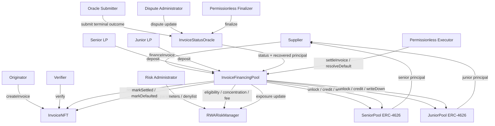
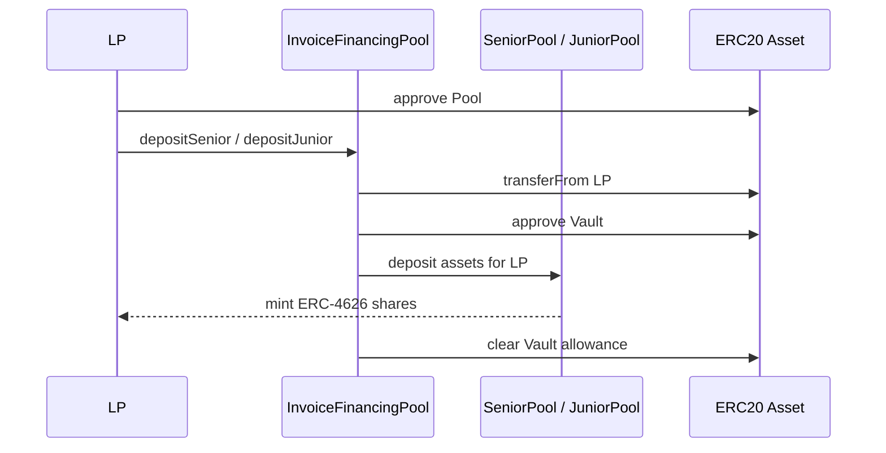
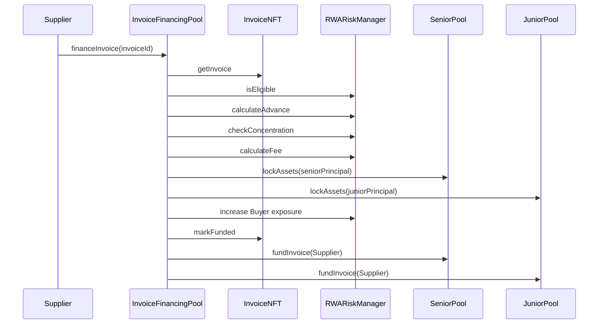

# RWA Invoice Financing Protocol Architecture

## Overview

The RWA Invoice Financing Protocol models the financing of real-world invoice receivables through an explicit on-chain lifecycle and a two-tranche capital structure.

The protocol separates five concerns:

1. invoice identity and lifecycle;
2. underwriting and Buyer concentration;
3. financing-position accounting;
4. Senior and Junior ERC-4626 tranche accounting;
5. reporting of off-chain settlement and default outcomes.

This separation is intentional.

No single contract is responsible for invoice creation, eligibility, capital custody, off-chain truth, and waterfall execution at the same time.

The architecture is designed around clear sources of truth, narrow permissions, deterministic accounting, and independently testable components.

---

# 1. High-Level Architecture



---

# 2. Architectural Goals

The v1 architecture prioritizes:

* explicit lifecycle transitions;
* deterministic tranche accounting;
* separation of off-chain truth from on-chain execution;
* isolation between financing positions;
* preservation of accounting history;
* independently enforced liquidity constraints;
* transparent trust assumptions;
* minimal hidden accounting state;
* auditability over feature breadth.

The protocol deliberately avoids combining all behavior into one monolithic contract.

Each component has a narrow responsibility and must not silently assume the responsibility of another component.

---

# 3. Contract Responsibility Map

| Contract                   | Primary Responsibility                    | Canonical State                                                              |
| -------------------------- | ----------------------------------------- | ---------------------------------------------------------------------------- |
| `InvoiceNFT.sol`           | Invoice identity and lifecycle            | Invoice status, Supplier, Buyer, face value, due date, funding timestamp     |
| `RWARiskManager.sol`       | Underwriting and concentration control    | Risk parameters, Buyer denylist, active Buyer exposure                       |
| `InvoiceFinancingPool.sol` | SPV coordination and financing accounting | Financing positions, finalized outcomes, total locked assets, total bad debt |
| `SeniorPool.sol`           | Senior ERC-4626 tranche                   | Senior NAV, locked assets, shares, available liquidity                       |
| `JuniorPool.sol`           | Junior ERC-4626 tranche                   | Junior NAV, locked assets, shares, available liquidity                       |
| `InvoiceStatusOracle.sol`  | Off-chain terminal outcome reporting      | Submitted, disputed, stale, and finalized oracle updates                     |

No contract should be treated as the universal source of truth.

The protocol instead uses multiple explicit sources of truth, each limited to its own domain.

---

# 4. Sources of Truth

## 4.1 InvoiceNFT — Lifecycle Source of Truth

`InvoiceNFT` determines whether an invoice is:

* `CREATED`;
* `VERIFIED`;
* `FUNDED`;
* `SETTLED`;
* `DEFAULTED`;
* `FROZEN`.

It also stores the previous financial status required to restore an invoice after unfreeze.

The pool must not independently invent lifecycle state.

Settlement and default accounting complete only when the corresponding InvoiceNFT transition succeeds in the same transaction.

---

## 4.2 InvoiceFinancingPool — Position Accounting Source of Truth

`InvoiceFinancingPool` stores the immutable accounting terms created at funding time:

```solidity
struct FinancingPosition {
    address supplier;
    address buyer;
    uint256 principal;
    uint256 seniorPrincipal;
    uint256 juniorPrincipal;
    uint256 financingFee;
    uint256 fundedAt;
    uint256 dueDate;
    bool resolved;
}
```

These values are reused during settlement and default resolution.

Current Risk Manager parameters or later configuration changes must not affect already funded positions.

The pool also stores:

* finalized oracle status;
* finalized recovered principal;
* aggregate unresolved principal;
* cumulative realized principal bad debt.

---

## 4.3 RWARiskManager — Underwriting Source of Truth

`RWARiskManager` determines:

* intrinsic invoice eligibility;
* Buyer denylist status;
* advance calculation;
* financing fee calculation;
* concentration capacity;
* active financed principal exposure per Buyer.

Eligibility and concentration are intentionally separate.

An invoice may be intrinsically eligible while still being rejected because financing it would exceed the Buyer exposure limit.

---

## 4.4 Tranche Vaults — NAV and Liquidity Sources of Truth

SeniorPool and JuniorPool independently store:

* `accountedAssets`;
* `lockedAssets`;
* ERC-4626 share supply and balances;
* raw underlying token balance.

The coordinator must not calculate tranche NAV using its own aggregate storage.

Each vault is authoritative for its own accounting.

---

## 4.5 InvoiceStatusOracle — Finalized Off-Chain Outcome Source

The oracle reports:

* the terminal off-chain status;
* recovered principal for defaulted invoices.

A finalized oracle outcome does not directly change InvoiceNFT state and does not execute accounting.

It becomes an immutable input that the pool later consumes.

---

# 5. InvoiceNFT Architecture

## 5.1 Non-Transferable Financial Claims

Invoice NFTs represent protocol-recognized invoice claims rather than freely transferable collectibles.

Transfers are disabled in v1.

This prevents lifecycle authority or financing identity from moving through ordinary ERC-721 transfers without corresponding underwriting and legal controls.

Secondary invoice trading is outside the v1 scope.

---

## 5.2 Role Separation

InvoiceNFT uses separate roles for:

* invoice creation;
* invoice verification;
* risk freeze and unfreeze;
* pool-driven financial transitions.

The expected authority model is:

```text
Originator creates.
Verifier verifies.
Supplier requests financing.
Pool marks funded.
Risk role freezes or unfreezes.
Pool marks settled or defaulted.
```

This prevents a single operational action from silently granting authority over the entire lifecycle.

---

## 5.3 Freeze Overlay

`FROZEN` is an operational overlay, not a terminal financial state.

An invoice may be frozen only from:

* `VERIFIED`;
* `FUNDED`.

The previous financial status is stored.

Unfreeze restores that previous status without changing:

* principal;
* fee;
* Buyer exposure;
* tranche NAV;
* locked assets;
* finalized oracle outcome.

A frozen funded invoice may already have a finalized oracle outcome, but accounting execution remains blocked until unfreeze.

---

# 6. Risk Manager Architecture

## 6.1 Intrinsic Eligibility

Eligibility includes:

* InvoiceNFT status is `VERIFIED`;
* face value meets the minimum amount;
* due date remains in the future;
* remaining tenor does not exceed the maximum;
* Buyer is not denied.

A non-existent invoice returns false instead of bubbling an InvoiceNFT revert through the eligibility API.

---

## 6.2 Concentration

Buyer exposure tracks active financed principal.

It does not represent:

* invoice face value;
* financing fee;
* expected repayment;
* lifetime financing volume.

The pool checks concentration before financing and updates exposure atomically during financing.

Exposure decreases only after successful settlement or default resolution.

---

## 6.3 Bounded Configuration

Risk parameters are constrained by implementation-level bounds.

This prevents technically invalid configurations but does not guarantee economically safe underwriting.

Parameter quality remains an administrative and off-chain risk-management responsibility.

---

# 7. InvoiceFinancingPool Architecture

## 7.1 On-Chain SPV Coordinator

`InvoiceFinancingPool` acts as the protocol coordination and SPV layer.

It does not hold all LP capital as one undifferentiated balance.

Instead, it coordinates two independent tranche vaults.

The pool is responsible for:

* deploying SeniorPool and JuniorPool;
* wrapping LP deposits and withdrawals;
* checking financing eligibility;
* storing financing positions;
* locking tranche capital;
* advancing capital to Suppliers;
* recording finalized oracle outcomes;
* executing paid and default waterfalls;
* reducing Buyer exposure;
* resolving InvoiceNFT lifecycle state.

---

## 7.2 One-Time Oracle Configuration

The pool's oracle address is configured once.

This prevents an administrator from silently changing the source of off-chain truth after deployment.

The pool callback independently verifies:

* oracle has been configured;
* callback caller is the configured oracle;
* status is an allowed terminal status;
* financing position exists;
* outcome has not already been finalized;
* recovery is valid for the status;
* default recovery does not exceed principal.

---

## 7.3 Existing Position Requirement

Oracle outcomes may be recorded only for existing financed positions.

The pool does not allow an outcome to be preloaded before financing.

This prevents:

* terminal outcomes for nonexistent positions;
* recovery values being stored against zero principal;
* invoices becoming financed after an outcome was already finalized;
* ambiguity between lifecycle state and accounting state.

---

## 7.4 Position Resolution Guard

Each financing position contains:

```solidity
bool resolved;
```

The flag prevents:

* settlement twice;
* default twice;
* settlement after default;
* default after settlement.

The position remains stored after resolution for auditability.

---

# 8. Senior and Junior Tranche Architecture

## 8.1 Separate ERC-4626 Vaults

SeniorPool and JuniorPool are independent ERC-4626 vaults.

Each tranche has its own:

* LP shares;
* NAV;
* locked assets;
* available liquidity;
* raw token balance;
* loss exposure.

This prevents aggregate liquidity from hiding a shortage in one tranche.

Funding must pass separate Senior and Junior liquidity checks.

---

## 8.2 Funding Split

Financed principal is split according to immutable funding-share parameters:

```solidity
seniorPrincipal =
    principal * seniorFundingShareBps / 10_000;

juniorPrincipal =
    principal - seniorPrincipal;
```

Any rounding remainder is allocated to JuniorPool.

The split is stored in the financing position and reused during resolution.

---

## 8.3 Fee Split

Financing fee allocation is independent from funding allocation.

```solidity
juniorFee =
    financingFee * juniorFeeShareBps / 10_000;

seniorFee =
    financingFee - juniorFee;
```

Junior may receive a larger relative fee share because it absorbs first-loss exposure.

Funding shares and fee shares represent different economic decisions.

---

# 9. NAV, Cash, and Locked Exposure

## 9.1 Why Raw Balance Is Not NAV

When an invoice is funded, tranche tokens leave the vault and are transferred to the Supplier.

The tranche still owns economic exposure to the receivable.

Reducing NAV merely because tokens left the vault would incorrectly recognize a loss at the moment of financing.

Therefore:

```text
accounted NAV = free cash + active receivable exposure + realized yield - realized loss
```

Raw token balance represents only immediately held cash.

---

## 9.2 Accounted Assets

Each tranche overrides ERC-4626 `totalAssets()` to return internal `accountedAssets`.

`accountedAssets` changes when:

* an LP deposits;
* an LP withdraws;
* realized fee income is credited;
* realized loss is written down.

Funding and unlocking do not independently change NAV.

---

## 9.3 Locked Assets

`lockedAssets` represents the portion of NAV committed to unresolved financing positions.

```solidity
availableLiquidity =
    accountedAssets - lockedAssets;
```

Funding increases locked assets.

Settlement or default resolution decreases locked assets using the original stored principal split.

---

## 9.4 Raw Cash Backing

A vault withdrawal is limited by:

1. the LP's share value;
2. accounting available liquidity;
3. the vault's raw token balance.

This distinction is necessary because valid NAV may include receivable exposure that is not currently liquid.

---

## 9.5 Yield Credit

During settlement, principal repayment restores cash backing for NAV that already existed.

Only the financing fee represents incremental realized yield.

Therefore `creditAssets()` receives the fee component only.

Crediting principal again would double-count tranche NAV.

---

## 9.6 Loss Recognition

During default, principal loss reduces tranche NAV through `writeDown()`.

LP shares are not burned.

The reduction in `accountedAssets` causes ERC-4626 share price to decline naturally.

---

# 10. Capital Flow

## 10.1 LP Deposit Flow



The coordinator wraps the ERC-4626 deposit but the tranche vault remains the share issuer and NAV authority.

---

## 10.2 Invoice Financing Flow



The Supplier is the only address allowed to request financing for its invoice.

The pool performs all accounting and cash movement atomically.

---

# 11. Oracle Architecture

## 11.1 Submission

An address with `ORACLE_SUBMITTER_ROLE` may submit:

```text
SETTLED + zero recovery
```

or:

```text
DEFAULTED + recovered principal
```

The oracle verifies that InvoiceNFT status is `FUNDED`.

The update is stored but is not immediately actionable.

---

## 11.2 Dispute

An address with `DISPUTE_ADMIN_ROLE` may dispute an active update while `block.timestamp <= submittedAt + DISPUTE_WINDOW`.

A disputed update cannot be finalized.

A replacement update may later be submitted.

---

## 11.3 Staleness

An update becomes stale only when `block.timestamp > submittedAt + MAX_STALENESS`.

Finalization remains allowed at the exact maximum-staleness boundary. After that boundary, finalization reverts and the stale update may be replaced.

The maximum staleness period must exceed the dispute window.

---

## 11.4 Finalization

Finalization is permissionless.

While `block.timestamp >= submittedAt + DISPUTE_WINDOW` and `block.timestamp <= submittedAt + MAX_STALENESS`, any address may call:

```solidity
finalize(invoiceId)
```

At the exact dispute-window boundary, both dispute and finalization are timing-valid, but only the first executed transaction succeeds. The later transaction reverts because the update is already disputed or finalized.

The oracle:

1. marks the update finalized;
2. calls the pool callback;
3. emits the complete outcome and finalization timestamp.

If the pool callback reverts, the entire transaction reverts, including the oracle's local finalization state.

---

# 12. Settlement Flow

Settlement requires a finalized `SETTLED` oracle outcome with zero recovery.

A payer calls:

```solidity
settleInvoice(invoiceId, paidAmount)
```

The payer must supply at least:

```solidity
principal + financingFee
```

The pool then:

1. marks the position resolved;
2. decreases aggregate locked principal;
3. transfers Senior principal and fee;
4. transfers Junior principal and fee;
5. returns surplus to the Supplier;
6. unlocks both tranche principal amounts;
7. credits fee yield;
8. decreases Buyer exposure;
9. marks InvoiceNFT `SETTLED`.

Settlement does not change `totalBadDebt`.

---

# 13. Default Flow

## 13.1 Oracle-Attested Recovery

The oracle finalizes:

```text
DEFAULTED + recovered principal
```

Recovered principal is an off-chain economic fact.

It is not provided by the default executor.

The pool stores:

```solidity
finalizedRecoveryAmount[invoiceId]
```

---

## 13.2 H-01 Trust-Boundary Remediation

The original design allowed:

```solidity
resolveDefault(invoiceId, recoveredAmount)
```

A permissionless caller could select the amount used by the waterfall.

The corrected design uses:

```solidity
resolveDefault(invoiceId)
```

The pool reads the oracle-finalized amount from storage.

The executor can trigger execution but cannot modify recovery.

This closes the caller-controlled recovery boundary described in `RISKS.md`.

---

## 13.3 Recovery Allocation

Recovery is allocated to Senior first:

```solidity
seniorRecovery =
    min(recoveredAmount, seniorPrincipal);
```

Junior receives the remainder:

```solidity
juniorRecovery =
    recoveredAmount - seniorRecovery;
```

---

## 13.4 Loss Allocation

Losses are calculated per tranche:

```solidity
seniorLoss =
    seniorPrincipal - seniorRecovery;

juniorLoss =
    juniorPrincipal - juniorRecovery;
```

Because recovery is allocated to Senior first, Junior absorbs loss first.

Junior NAV is written down before Senior NAV.

---

## 13.5 Bad Debt

Protocol bad debt tracks realized principal loss:

```solidity
loss =
    principal - recoveredAmount;
```

```solidity
totalBadDebt += loss;
```

Unpaid financing fee is excluded because it was never recognized as tranche NAV.

---

## 13.6 Recovery Token Supply

The permissionless executor must hold and approve the exact oracle-finalized recovered amount.

This is a simplified v1 execution model.

A production system would more likely route recovered assets through:

* a servicing account;
* a collection escrow;
* a prefunded recovery account;
* a bank-payment reconciliation adapter.

---

# 14. Atomicity and CEI

Financing, settlement, and default resolution span multiple contracts.

The architecture relies on EVM transaction atomicity.

The pool generally follows checks-effects-interactions:

1. validate lifecycle and accounting preconditions;
2. update local resolution state;
3. perform token and vault interactions;
4. update external protocol components;
5. complete the InvoiceNFT transition.

If any downstream call fails, all prior state and token effects revert.

This prevents partial completion across:

* financing positions;
* tranche NAV;
* tranche locked assets;
* aggregate locked assets;
* Buyer exposure;
* InvoiceNFT state;
* token balances.

---

# 15. Role and Trust Boundaries

| Actor or Role         | Trusted For                                   | Not Trusted For                              |
| --------------------- | --------------------------------------------- | -------------------------------------------- |
| Originator            | Invoice data submission                       | Verification, settlement truth, accounting   |
| Verifier              | Invoice lifecycle verification                | Financing execution, oracle truth            |
| Supplier              | Requesting its own financing                  | Settlement status, recovery amount           |
| Risk Administrator    | Bounded risk configuration and freeze control | Waterfall override                           |
| Oracle Submitter      | Off-chain terminal outcome and recovery       | Token movement and NAV accounting            |
| Dispute Administrator | Challenging active oracle updates             | Final accounting outcome                     |
| Pool Administrator    | One-time oracle configuration                 | Manual outcome injection                     |
| Executor              | Supplying tokens and triggering execution     | Choosing status, recovery, fee, or waterfall |
| Senior LP             | Supplying Senior capital                      | Underwriting and settlement control          |
| Junior LP             | Supplying first-loss capital                  | Underwriting and settlement control          |

The protocol constrains trusted actors instead of pretending that off-chain truth is trustless.

---

# 16. Deployment and Wiring

The expected deployment sequence is:

1. deploy the underlying ERC-20 asset or select an existing settlement asset;
2. deploy `InvoiceNFT`;
3. deploy `RWARiskManager` with initial bounded parameters;
4. deploy `InvoiceFinancingPool`;
5. allow the pool constructor to deploy SeniorPool and JuniorPool;
6. deploy `InvoiceStatusOracle`;
7. configure the oracle address in InvoiceFinancingPool;
8. grant InvoiceNFT operational roles;
9. grant Risk Manager pool role to InvoiceFinancingPool;
10. grant InvoiceNFT pool role to InvoiceFinancingPool;
11. assign oracle submitter and dispute roles;
12. verify all immutable addresses and role assignments.

The deployment process must verify that:

* SeniorPool and JuniorPool point to the same coordinator;
* all contracts use the same underlying asset where applicable;
* the pool points to the intended InvoiceNFT and Risk Manager;
* the oracle points to the intended InvoiceNFT and pool;
* the pool's configured oracle is correct;
* operational roles are not unintentionally collapsed.

---

# 17. Failure Isolation

The architecture is designed so that resolving one invoice does not mutate unrelated positions.

Per-invoice state includes:

* immutable financing terms;
* finalized oracle outcome;
* resolution flag.

Aggregate state changes only by the resolved invoice's stored amounts.

Expected isolation properties include:

* resolving invoice A does not change invoice B's position;
* resolving invoice A decreases Buyer exposure only by A's principal;
* resolving invoice A unlocks only A's Senior and Junior principal;
* invoice B remains active and fund accounting remains intact;
* finalized outcomes are isolated by invoice ID.

---

# 18. External Assumptions

The contracts assume:

* invoice records correspond to genuine off-chain receivables;
* Buyer and Supplier addresses are correctly associated;
* role-bearing accounts are secured;
* the oracle reports accurate off-chain outcomes;
* recovered assets correspond to reported recovered principal;
* the underlying ERC-20 is non-rebasing;
* the underlying asset has no transfer fee;
* token transfers conform to SafeERC20 expectations;
* off-chain legal assignment and collection are valid.

The contracts do not independently verify:

* invoice authenticity;
* Buyer acceptance;
* bank payment;
* legal enforceability;
* cross-protocol double financing;
* off-chain recovery records;
* servicing fraud.

These risks are documented in `RISKS.md`.

---

# 19. Out-of-Scope Production Components

The following production components are outside the v1 architecture:

* multi-oracle quorum;
* governance timelock;
* recovery escrow;
* automated bank reconciliation;
* KYC and LP whitelisting;
* protocol-wide emergency pause;
* withdrawal queue;
* liquidity epochs;
* insurance reserve;
* external invoice registry integration;
* document-hash verification;
* legal assignment registry;
* refinancing;
* restructuring;
* partial settlement;
* upgradeability;
* secondary invoice trading.

Their exclusion keeps the implementation focused on core lifecycle, trust-boundary, and tranche-accounting behavior.

---

# 20. Architecture Summary

The protocol is built around five independent sources of truth:

```text
InvoiceNFT
    → lifecycle truth

RWARiskManager
    → underwriting and Buyer exposure truth

InvoiceStatusOracle
    → finalized off-chain outcome truth

InvoiceFinancingPool
    → financing-position and protocol accounting truth

SeniorPool / JuniorPool
    → tranche NAV, shares, and liquidity truth
```

The central security boundary is:

```text
Oracle attests economic truth.
Pool validates and stores it.
Executor supplies assets and triggers deterministic accounting.
```

No permissionless executor may choose:

* terminal status;
* recovered principal;
* financed principal;
* financing fee;
* tranche allocation;
* loss allocation.

This separation is the foundation of the v1 protocol architecture.
