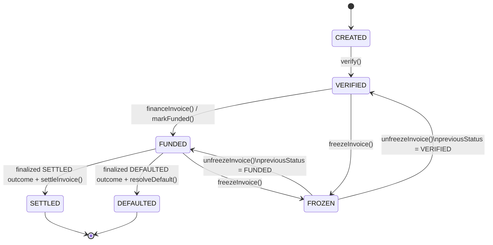
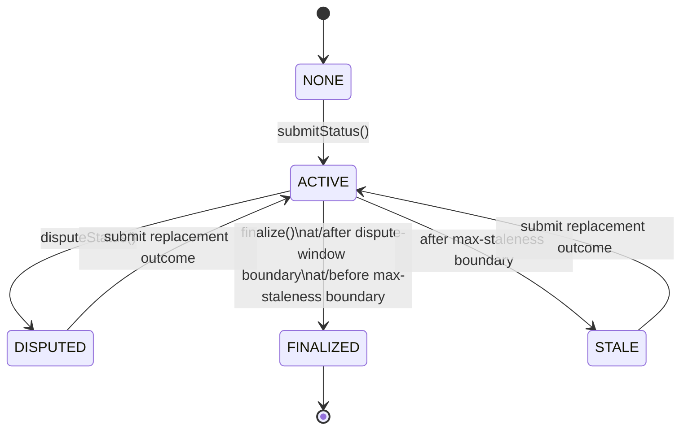

# RWA Invoice Financing Protocol State Machine

## Overview

The protocol uses two related but separate state machines:

1. **Invoice lifecycle state machine** — implemented by `InvoiceNFT.sol`;
2. **Oracle outcome state machine** — implemented by `InvoiceStatusOracle.sol`.

A third layer, `InvoiceFinancingPool.sol`, connects them by:

* creating financing positions;
* recording finalized oracle outcomes;
* executing settlement or default accounting;
* applying terminal InvoiceNFT transitions.

Oracle finalization is not the same as invoice resolution.

A finalized oracle outcome records off-chain truth, while settlement or default execution applies the corresponding on-chain accounting effects.

---

# 1. Invoice Lifecycle States

```solidity
enum InvoiceStatus {
    CREATED,
    VERIFIED,
    FUNDED,
    SETTLED,
    DEFAULTED,
    FROZEN
}
```

The lifecycle is:

```text
CREATED
   |
   v
VERIFIED
   |
   v
 FUNDED
  /   \
 v     v
SETTLED DEFAULTED
```

`FROZEN` is an operational overlay available only from:

```text
VERIFIED → FROZEN → VERIFIED
FUNDED   → FROZEN → FUNDED
```

`SETTLED` and `DEFAULTED` are terminal.

---

# 2. Invoice Lifecycle Diagram



---

# 3. CREATED State

## Meaning

`CREATED` represents an invoice that has been registered but not yet approved for financing.

The invoice record contains:

* Supplier;
* Buyer;
* face value;
* due date;
* zero funding timestamp;
* lifecycle status.

## Entry

An address holding `ORIGINATOR_ROLE` calls:

```solidity
createInvoice(
    supplier,
    buyer,
    faceValue,
    dueDate
)
```

## Guards

* Supplier must not be the zero address.
* Buyer must not be the zero address.
* Face value must be greater than zero.
* Due date must be in the future.

## Accounting Effects

None.

No tranche liquidity is locked.

No Buyer exposure exists.

No financing position exists.

## Allowed Exit

```text
CREATED → VERIFIED
```

## Forbidden Exits

```text
CREATED → FUNDED
CREATED → SETTLED
CREATED → DEFAULTED
CREATED → FROZEN
```

---

# 4. CREATED → VERIFIED

## Trigger

An address holding `VERIFIER_ROLE` calls:

```solidity
verify(invoiceId)
```

## Guards

* Invoice exists.
* Current status is `CREATED`.

## Effects

```text
status = VERIFIED
```

## Accounting Effects

None.

Verification does not:

* create principal;
* lock liquidity;
* update Buyer exposure;
* calculate fees;
* transfer assets.

## Security Property

The Originator and Verifier roles are logically separate.

Invoice creation alone must not make an invoice financeable.

---

# 5. VERIFIED State

## Meaning

`VERIFIED` represents an invoice that passed lifecycle verification and may be considered for financing.

Verification does not guarantee financing.

The invoice must still satisfy:

* Risk Manager eligibility;
* Buyer concentration limits;
* tranche liquidity requirements;
* Supplier-only execution authority.

## Allowed Exits

```text
VERIFIED → FUNDED
VERIFIED → FROZEN
```

## Forbidden Exits

```text
VERIFIED → SETTLED
VERIFIED → DEFAULTED
VERIFIED → CREATED
```

---

# 6. VERIFIED → FUNDED

## Trigger

The recorded Supplier calls:

```solidity
financeInvoice(invoiceId)
```

on `InvoiceFinancingPool`.

The pool later calls:

```solidity
InvoiceNFT.markFunded(invoiceId)
```

within the same atomic transaction.

## Guards

The pool requires:

* invoice exists;
* caller equals the recorded Supplier;
* financing position does not already exist;
* invoice passes Risk Manager eligibility;
* Buyer concentration remains within the configured limit;
* SeniorPool has enough available liquidity;
* JuniorPool has enough available liquidity.

Risk Manager eligibility requires:

* InvoiceNFT status is `VERIFIED`;
* face value meets the configured minimum;
* due date remains in the future;
* remaining tenor does not exceed the maximum;
* Buyer is not denied.

## Effects

The pool:

1. calculates principal;
2. calculates Senior principal;
3. calculates Junior principal;
4. calculates the financing fee;
5. stores the financing position;
6. increases aggregate locked assets;
7. locks Senior liquidity;
8. locks Junior liquidity;
9. increases Buyer exposure;
10. marks InvoiceNFT `FUNDED`;
11. transfers Senior and Junior capital to the Supplier.

## Stored Position

```solidity
struct FinancingPosition {
    address supplier;
    address buyer;
    uint256 principal;
    uint256 seniorPrincipal;
    uint256 juniorPrincipal;
    uint256 financingFee;
    uint256 fundedAt;
    uint256 dueDate;
    bool resolved;
}
```

## Atomicity

All effects occur in one transaction.

If any downstream operation fails, all lifecycle, accounting, exposure, and token changes revert.

## Security Properties

After successful funding:

```text
financingPosition.fundedAt != 0
InvoiceNFT.status == FUNDED
position.resolved == false
```

The same invoice cannot be funded again.

---

# 7. FUNDED State

## Meaning

`FUNDED` represents an active financing position.

The Supplier has received principal.

Senior and Junior capital remain part of tranche NAV but are marked as locked.

Buyer exposure remains active.

## Allowed Exits

```text
FUNDED → SETTLED
FUNDED → DEFAULTED
FUNDED → FROZEN
```

## Required Intermediate Oracle State

Settlement and default require a finalized oracle outcome before accounting execution.

Therefore the full path is not simply:

```text
FUNDED → SETTLED
```

but:

```text
FUNDED
  → oracle outcome submitted
  → dispute window
  → oracle outcome finalized
  → settlement accounting executed
  → SETTLED
```

The default path follows the same separation.

---

# 8. Oracle Outcome States

The oracle uses the following logical states:

```text
NONE
ACTIVE
DISPUTED
STALE
FINALIZED
```

These states are represented through:

```solidity
struct StatusUpdate {
    uint256 invoiceId;
    IInvoiceNFT.InvoiceStatus newStatus;
    uint256 recoveredAmount;
    uint256 submittedAt;
    bool disputed;
    bool finalized;
}
```

`STALE` is derived from time rather than stored as a boolean.

---

# 9. Oracle State Diagram



---

# 10. Oracle NONE State

## Meaning

No oracle update exists for the invoice.

This is represented by:

```text
submittedAt == 0
```

## Allowed Exit

```text
NONE → ACTIVE
```

through `submitStatus()`.

## Invalid Operations

The following must revert:

* dispute;
* finalize.

---

# 11. Oracle Submission

## Trigger

An address holding `ORACLE_SUBMITTER_ROLE` calls:

```solidity
submitStatus(
    invoiceId,
    newStatus,
    recoveredAmount
)
```

## Allowed Statuses

Only:

```text
SETTLED
DEFAULTED
```

All other InvoiceNFT statuses are invalid oracle outcomes.

## Invoice Guard

InvoiceNFT must currently be:

```text
FUNDED
```

An oracle update cannot be submitted while the invoice is:

* `CREATED`;
* `VERIFIED`;
* `SETTLED`;
* `DEFAULTED`;
* `FROZEN`.

## Recovery Rules

For settlement:

```text
newStatus = SETTLED
recoveredAmount = 0
```

For default:

```text
newStatus = DEFAULTED
recoveredAmount >= 0
```

The upper principal boundary is validated by the pool callback during finalization.

## Active Update Guard

An existing active update cannot be overwritten.

An update is active when:

```text
submittedAt != 0
disputed == false
finalized == false
block.timestamp <= submittedAt + MAX_STALENESS
```

## Replacement Updates

Replacement is allowed only if the previous update:

* was disputed; or
* became stale.

The replacement may change:

* terminal status;
* recovered principal;
* submission timestamp.

---

# 12. Oracle ACTIVE State

## Meaning

An outcome has been submitted but is not yet finalized.

It remains challengeable during the dispute window.

## Derived Time Boundaries

```text
earliestFinalizeAt =
    submittedAt + DISPUTE_WINDOW
```

```text
staleAfter =
    submittedAt + MAX_STALENESS
```

## Allowed Exits

```text
ACTIVE → DISPUTED
ACTIVE → FINALIZED
ACTIVE → STALE
```

---

# 13. ACTIVE → DISPUTED

## Trigger

An address holding `DISPUTE_ADMIN_ROLE` calls:

```solidity
disputeStatus(invoiceId)
```

## Guards

* Update exists.
* Update is not finalized.
* Update is not already disputed.
* `block.timestamp <= submittedAt + DISPUTE_WINDOW`.

This includes the exact dispute-window boundary.

## Effects

```text
disputed = true
```

The stored status and recovery remain available for auditability but cannot be finalized.

## Allowed Exit

A new update may be submitted:

```text
DISPUTED → ACTIVE
```

---

# 14. ACTIVE → STALE

## Trigger

No explicit state-changing call is required.

The update becomes stale when:

```text
block.timestamp > submittedAt + MAX_STALENESS
```

## Effects

The update remains stored but cannot be finalized.

## Allowed Exit

A replacement update may be submitted:

```text
STALE → ACTIVE
```

---

# 15. ACTIVE → FINALIZED

## Trigger

Any address calls:

```solidity
finalize(invoiceId)
```

## Guards

* Update exists.
* Update is not disputed.
* Update is not finalized.
* `block.timestamp >= submittedAt + DISPUTE_WINDOW`.
* `block.timestamp <= submittedAt + MAX_STALENESS`.
* Status is still an allowed terminal status.

At the exact dispute-window boundary, both dispute and finalization are timing-valid, but only the first executed transaction succeeds. The later transaction reverts because the update is already disputed or finalized. Finalization is also valid at the exact maximum-staleness boundary and reverts after that boundary.

## Effects

The oracle:

1. marks the update finalized;
2. calls `InvoiceFinancingPool.onStatusFinalized(...)`;
3. emits the finalized outcome and finalization timestamp.

## Atomicity

The local oracle update is marked finalized before the pool callback.

If the callback reverts, the entire transaction reverts.

Therefore the update does not remain finalized unless the pool successfully records the outcome.

---

# 16. Pool Finalized Outcome State

The pool stores:

```solidity
mapping(uint256 => InvoiceStatus)
    finalizedOracleStatus;

mapping(uint256 => uint256)
    finalizedRecoveryAmount;
```

## Pool Callback

```solidity
onStatusFinalized(
    invoiceId,
    status,
    recoveredAmount
)
```

## Guards

The pool requires:

* oracle is configured;
* caller is the configured oracle;
* status is `SETTLED` or `DEFAULTED`;
* financing position exists;
* outcome has not already been finalized;
* `SETTLED` recovery is zero;
* `DEFAULTED` recovery does not exceed stored principal.

## Effects

The pool records:

```text
finalizedOracleStatus[invoiceId]
finalizedRecoveryAmount[invoiceId]
```

These values are immutable after finalization.

## Important Separation

Pool oracle finalization does not:

* mark the financing position resolved;
* release locked capital;
* decrease Buyer exposure;
* modify tranche NAV;
* transfer assets;
* mark InvoiceNFT terminal.

After finalization and before accounting execution, the current `InvoiceNFT` status may be `FUNDED`, or `FROZEN` with `previousStatus` equal to `FUNDED`. Finalization does not change `InvoiceNFT` status or mark it terminal.

---

# 17. Finalized SETTLED Outcome

After the pool stores a finalized `SETTLED` outcome:

```text
InvoiceNFT.status == FUNDED
    OR (
        InvoiceNFT.status == FROZEN
        AND InvoiceNFT.previousStatus == FUNDED
    )
position.resolved == false
finalizedOracleStatus == SETTLED
finalizedRecoveryAmount == 0
```

The position is ready for paid-path execution only while the current `InvoiceNFT` status is `FUNDED`. If the invoice is `FROZEN`, finalization remains recorded but execution is blocked until unfreeze.

## Allowed Execution

```solidity
settleInvoice(invoiceId, paidAmount)
```

## Forbidden Execution

```solidity
resolveDefault(invoiceId)
```

must revert because the finalized status is not `DEFAULTED`.

---

# 18. FUNDED → SETTLED

## Trigger

Any payer calls:

```solidity
settleInvoice(
    invoiceId,
    paidAmount
)
```

## Guards

* Financing position exists.
* Position is unresolved.
* Oracle outcome is finalized.
* Finalized status is `SETTLED`.
* InvoiceNFT is not `FROZEN`.
* InvoiceNFT status is `FUNDED`.
* Paid amount is at least principal plus stored financing fee.

## Expected Repayment

```solidity
expectedRepayment =
    principal + financingFee;
```

## Effects

The pool:

1. calculates Senior fee;
2. calculates Junior fee;
3. calculates surplus;
4. marks the position resolved;
5. decreases aggregate locked assets;
6. transfers Senior repayment;
7. transfers Junior repayment;
8. transfers surplus to the Supplier;
9. unlocks Senior principal;
10. unlocks Junior principal;
11. credits Senior fee;
12. credits Junior fee;
13. decreases Buyer exposure;
14. marks InvoiceNFT `SETTLED`.

## Post-State

```text
InvoiceNFT.status == SETTLED
position.resolved == true
totalLockedAssets decreased by principal
Buyer exposure decreased by principal
Senior lockedAssets decreased by seniorPrincipal
Junior lockedAssets decreased by juniorPrincipal
totalBadDebt unchanged
```

## Terminal Property

No further settlement or default resolution is allowed.

---

# 19. Finalized DEFAULTED Outcome

After the pool stores a finalized `DEFAULTED` outcome:

```text
InvoiceNFT.status == FUNDED
    OR (
        InvoiceNFT.status == FROZEN
        AND InvoiceNFT.previousStatus == FUNDED
    )
position.resolved == false
finalizedOracleStatus == DEFAULTED
finalizedRecoveryAmount <= principal
```

The position is ready for default execution only while the current `InvoiceNFT` status is `FUNDED`. If the invoice is `FROZEN`, finalization remains recorded but execution is blocked until unfreeze.

## Allowed Execution

```solidity
resolveDefault(invoiceId)
```

## Forbidden Execution

```solidity
settleInvoice(invoiceId, paidAmount)
```

must revert because the finalized status is not `SETTLED`.

---

# 20. FUNDED → DEFAULTED

## Trigger

Any executor calls:

```solidity
resolveDefault(invoiceId)
```

The executor does not provide a recovery argument.

## Guards

* Financing position exists.
* Position is unresolved.
* Oracle outcome is finalized.
* Finalized status is `DEFAULTED`.
* InvoiceNFT is not `FROZEN`.
* InvoiceNFT status is `FUNDED`.
* Stored finalized recovery does not exceed principal.

## Recovery Source

```solidity
recoveredAmount =
    finalizedRecoveryAmount[invoiceId];
```

The executor cannot choose or modify recovery.

## Recovery Allocation

```solidity
seniorRecovery =
    min(recoveredAmount, seniorPrincipal);
```

```solidity
juniorRecovery =
    recoveredAmount - seniorRecovery;
```

## Loss Allocation

```solidity
seniorLoss =
    seniorPrincipal - seniorRecovery;
```

```solidity
juniorLoss =
    juniorPrincipal - juniorRecovery;
```

```solidity
loss =
    principal - recoveredAmount;
```

## Effects

The pool:

1. marks the position resolved;
2. decreases aggregate locked assets;
3. increases cumulative bad debt;
4. transfers Senior recovery;
5. transfers Junior recovery;
6. unlocks Senior principal;
7. unlocks Junior principal;
8. writes down Junior loss;
9. writes down Senior residual loss;
10. decreases Buyer exposure;
11. marks InvoiceNFT `DEFAULTED`.

## Post-State

```text
InvoiceNFT.status == DEFAULTED
position.resolved == true
totalLockedAssets decreased by principal
Buyer exposure decreased by principal
Senior lockedAssets decreased by seniorPrincipal
Junior lockedAssets decreased by juniorPrincipal
totalBadDebt increased by principal - finalizedRecoveryAmount
```

## Terminal Property

No later settlement or second default is allowed.

---

# 21. H-01 State-Machine Boundary

The original design allowed:

```solidity
resolveDefault(
    invoiceId,
    recoveredAmount
)
```

This permitted the executor to choose a state-transition accounting input.

The corrected state machine requires:

```text
Oracle ACTIVE outcome
    contains recoveredAmount

Oracle FINALIZED outcome
    makes recoveredAmount immutable

Pool recorded outcome
    stores recoveredAmount

Default execution
    reads stored recoveredAmount
```

The executor now calls only:

```solidity
resolveDefault(invoiceId)
```

This ensures that execution authority cannot mutate off-chain economic truth.

---

# 22. VERIFIED → FROZEN

## Trigger

An address holding the InvoiceNFT Risk role calls:

```solidity
freezeInvoice(invoiceId)
```

## Guards

* Invoice exists.
* Current state is `VERIFIED`.

## Effects

```text
previousStatus = VERIFIED
status = FROZEN
```

## Accounting Effects

None.

The invoice has no active financing position.

## Consequence

The invoice cannot be financed until unfreezed.

---

# 23. FUNDED → FROZEN

## Trigger

An address holding the InvoiceNFT Risk role calls:

```solidity
freezeInvoice(invoiceId)
```

## Guards

* Invoice exists.
* Current state is `FUNDED`.

## Effects

```text
previousStatus = FUNDED
status = FROZEN
```

## Accounting Effects

None.

The following remain unchanged:

* financing position;
* principal;
* financing fee;
* Buyer exposure;
* aggregate locked assets;
* tranche locked assets;
* tranche NAV;
* finalized oracle outcome.

## Consequence

Settlement and default execution are blocked.

---

# 24. Oracle Behavior During Freeze

Freeze affects oracle submission and finalization differently.

## Freeze Before Submission

If InvoiceNFT is already `FROZEN`, `submitStatus()` reverts because the oracle accepts outcomes only while InvoiceNFT is `FUNDED`.

## Freeze After Submission

If an oracle update was submitted while the invoice was `FUNDED`, the invoice may later be frozen.

The existing update may still:

* be disputed;
* become stale;
* be finalized.

Oracle finalization is allowed because it does not execute accounting or mutate InvoiceNFT.

## Execution While Frozen

Even if the outcome is finalized, settlement and default execution revert while InvoiceNFT is `FROZEN`.

---

# 25. FROZEN → Previous Status

## Trigger

An address holding the Risk role calls:

```solidity
unfreezeInvoice(invoiceId)
```

## Guards

* Invoice exists.
* Current status is `FROZEN`.

## Effects

```text
status = previousStatus
```

The restored status must be:

* `VERIFIED`; or
* `FUNDED`.

## Accounting Effects

None.

## Consequences

If restored to `VERIFIED`:

* financing may proceed if all other guards pass.

If restored to `FUNDED`:

* settlement or default execution may proceed using any already finalized outcome.

---

# 26. SETTLED State

## Meaning

The financing position completed through the paid path.

## Properties

```text
position.resolved == true
InvoiceNFT.status == SETTLED
```

Principal has been restored.

Financing fee has been realized and distributed.

Buyer exposure has been removed.

Locked assets have been released.

## Forbidden Operations

* financing again;
* settlement again;
* default resolution;
* freeze;
* lifecycle rollback.

---

# 27. DEFAULTED State

## Meaning

The financing position completed through the default path.

## Properties

```text
position.resolved == true
InvoiceNFT.status == DEFAULTED
```

Recovered principal has been allocated.

Realized principal loss has been written down.

Buyer exposure has been removed.

Locked assets have been released.

Cumulative bad debt has increased by realized principal loss.

## Forbidden Operations

* financing again;
* settlement;
* default resolution again;
* freeze;
* lifecycle rollback.

---

# 28. Position Resolution State

The lifecycle state and the financing-position resolution flag are related but distinct.

Before accounting execution:

```text
InvoiceNFT.status == FUNDED
    OR (
        InvoiceNFT.status == FROZEN
        AND InvoiceNFT.previousStatus == FUNDED
    )
position.resolved == false
```

An unresolved `FROZEN` position is not executable. Execution becomes possible only after unfreeze restores `FUNDED`. Freeze and unfreeze do not change financing-position, Buyer-exposure, locked-liquidity, or tranche accounting.

After settlement:

```text
InvoiceNFT.status == SETTLED
position.resolved == true
```

After default:

```text
InvoiceNFT.status == DEFAULTED
position.resolved == true
```

`position.resolved` is updated before external calls for checks-effects-interactions safety.

If a later external call fails, EVM atomicity reverts the flag update.

---

# 29. Mutual Exclusion

Settlement and default are mutually exclusive through two independent controls.

## Oracle Outcome

Only one terminal status may be finalized per invoice.

## Position Resolution

The position may be resolved only once.

Therefore:

```text
finalized SETTLED
    excludes default execution
```

```text
finalized DEFAULTED
    excludes settlement execution
```

and:

```text
resolved == true
    excludes both repeated executions
```

---

# 30. Forbidden State Combinations

The following combinations must never persist after a successful transaction:

```text
InvoiceNFT.status == CREATED
financingPosition.fundedAt != 0
```

```text
InvoiceNFT.status == VERIFIED
position.resolved == true
```

```text
InvoiceNFT.status == SETTLED
position.resolved == false
```

```text
InvoiceNFT.status == DEFAULTED
position.resolved == false
```

```text
finalizedOracleStatus == SETTLED
finalizedRecoveryAmount != 0
```

```text
finalizedRecoveryAmount > position.principal
```

```text
position.resolved == true
totalLockedAssets still includes position.principal
```

```text
InvoiceNFT.status == FROZEN
previousStatus not in {VERIFIED, FUNDED}
```

---

# 31. Accounting Transition Summary

| Transition           |          Locked Assets |         Buyer Exposure |                Tranche NAV |                    Bad Debt |
| -------------------- | ---------------------: | ---------------------: | -------------------------: | --------------------------: |
| `CREATED → VERIFIED` |              unchanged |              unchanged |                  unchanged |                   unchanged |
| `VERIFIED → FUNDED`  | increases by principal | increases by principal |                  unchanged |                   unchanged |
| `FUNDED → FROZEN`    |              unchanged |              unchanged |                  unchanged |                   unchanged |
| `FROZEN → FUNDED`    |              unchanged |              unchanged |                  unchanged |                   unchanged |
| `FUNDED → SETTLED`   | decreases by principal | decreases by principal |  increases by realized fee |                   unchanged |
| `FUNDED → DEFAULTED` | decreases by principal | decreases by principal | decreases by realized loss | increases by principal loss |

---

# 32. Oracle Transition Summary

| Oracle Transition    | Allowed Condition                      | Pool Accounting Effect           |
| -------------------- | -------------------------------------- | -------------------------------- |
| `NONE → ACTIVE`      | funded invoice, authorized submitter   | none                             |
| `ACTIVE → DISPUTED`  | through exact dispute-window boundary  | none                             |
| `ACTIVE → STALE`     | maximum staleness exceeded             | none                             |
| `DISPUTED → ACTIVE`  | replacement submission                 | none                             |
| `STALE → ACTIVE`     | replacement submission                 | none                             |
| `ACTIVE → FINALIZED` | at or after `submittedAt + DISPUTE_WINDOW`; at or before `submittedAt + MAX_STALENESS` | pool records status and recovery |
| `FINALIZED → any`    | forbidden                              | none                             |

---

# 33. Execution Failure Semantics

A failed execution must leave the protocol unchanged.

Examples include:

* insufficient payer balance;
* insufficient token allowance;
* frozen invoice;
* unexpected oracle status;
* already resolved position;
* invalid lifecycle state;
* tranche accounting failure.

Because all operations occur atomically, a failed settlement or default execution must not partially change:

* `resolved`;
* aggregate locked assets;
* total bad debt;
* Buyer exposure;
* tranche locked assets;
* tranche NAV;
* InvoiceNFT status;
* token balances.

---

# 34. State Machine Security Properties

The state machine must guarantee:

* lifecycle progression is linear;
* funding occurs at most once;
* terminal outcomes are immutable;
* execution occurs at most once;
* oracle finalization and accounting execution are separate;
* off-chain truth is controlled only by the oracle boundary;
* accounting truth is controlled only by the pool;
* executors cannot select recovery;
* freeze cannot reset financial history;
* failed execution cannot leave partial state;
* one invoice cannot mutate another invoice's lifecycle or accounting state.

---

# 35. Summary

The protocol state machine separates three sequential decisions:

```text
1. Is the invoice eligible to become financed?
2. What off-chain terminal outcome occurred?
3. Can the corresponding accounting transition execute safely?
```

These decisions belong to different components:

```text
InvoiceNFT + Risk Manager
    → financing eligibility and lifecycle

InvoiceStatusOracle
    → off-chain terminal outcome

InvoiceFinancingPool
    → deterministic accounting execution
```

The central state-machine boundary is:

```text
Oracle finalization records truth.
Pool execution applies accounting.
InvoiceNFT records the completed lifecycle transition.
```

No actor may bypass that sequence.
